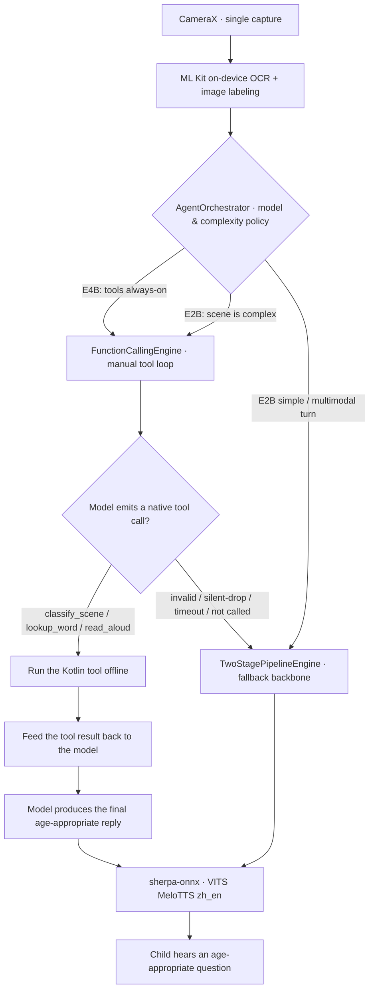
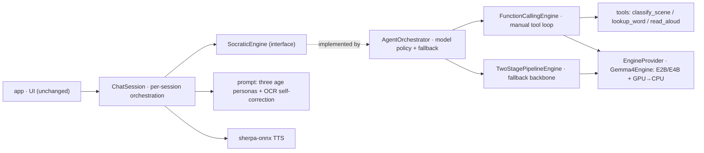

<p align="center">
  
</p>
<h1 align="center">LumiRead · 光语伴读</h1>
<p align="center"><b>English</b> | <a href="./README_ZH.md">简体中文</a></p>

> Offline, privacy-first picture-book reading companion for children, powered
> by on-device **Gemma 4 E2B**. Every spoken word, every photo, every reply
> stays on the device.

<p align="center">
  <a href="./LICENSE"></a>
  <a href="#4-system-requirements"></a>
  <a href="https://ai.google.dev/gemma"></a>
</p>

---

## 🎬 Demo Video

See LumiRead in action — offline picture-book reading, on-device Gemma 4 E2B,
warm Socratic-style companionship:

**▶️ [Watch the demo on Bilibili](https://www.bilibili.com/video/BV17Q7D6HEay/)**

<p align="center">
  <a href="https://www.bilibili.com/video/BV17Q7D6HEay/"></a>
</p>

---

## 🚀 Start Here — For Everyone (No Tech Needed)

New here? You don't need to know anything about code.

- **Just want to use it?** Download the latest **APK** from the [Releases](../../releases)
  page and install it on an Android phone. That's all.
- **Which AI "brain" should I pick?** (in the app's Settings)
  - **Younger children →** *E2B + separate OCR* — faster, with a more natural
    back-and-forth feel.
  - **Older children →** *E4B + separate OCR*.
  - The all-in-one **multimodal** mode is still experimental and **not very stable —
    choose it with caution.**
- On first launch the app downloads its offline AI model once (a few GB, Wi-Fi
  recommended). After that, everything runs without internet.

---

## Table of contents

1. [Overview](#1-overview)
2. [Built for Social Good](#2-built-for-social-good)
3. [Features](#3-features)
4. [How it works](#4-how-it-works)
5. [System requirements](#5-system-requirements)
6. [Install &amp; run (end users)](#6-install--run-end-users)
7. [Build from source (developers)](#7-build-from-source-developers)
8. [Privacy](#8-privacy)
9. [Acknowledgements](#9-acknowledgements)
10. [License](#10-license)
11. [Contributing](#11-contributing)
12. [Roadmap](#12-roadmap)
13. [Changelog](#13-changelog)

---

## 1. Overview

LumiRead is an Android app that turns any paper picture book into a warm,
patient, knowledgeable reading companion for a child — **without sending a
single byte off the device**.

**The problem.** Children's "digital companions" usually demand a screen,
a microphone live-stream to a cloud API, and an account. Parents pay with
their child's voice data, screen time, and attention span.

**Our take.** A paper book is still the best anchor for a child's
imagination. LumiRead keeps the book as the center of attention: you point
the phone at a page, and the app whispers a short, age-appropriate piece
of praise, explanation, and an inviting question — purely from on-device
inference. The phone is the storyteller's assistant, not the storyteller.

**Designed for**
- Parents and grandparents who want a co-reading helper that respects a
  child's privacy and screen time.
- Bilingual households (Chinese + English) where the adult is comfortable
  in only one of the two languages on a given page.
- Edge-AI enthusiasts who want a real, end-to-end example of a 2.5 GB-class
  language model running on a consumer phone with no network.

**Why it is interesting**
- **Fully offline.** No telemetry, no analytics, no cloud calls. Airplane
  mode is a supported runtime configuration.
- **Privacy by construction.** The only network call in the entire app is
  the one-time model download, and it can be replaced with `adb push`.
- **Edge AI that is actually usable.** First spoken word in roughly 4–6
  seconds on a Snapdragon-8-class device, fully on the GPU backend.
- **AI for Social Good.** Built for the 2026 Gemma Developer Hackathon,
  Edge AI track.

---

## 2. Built for Social Good

LumiRead runs **entirely on the device**. After a one-time model download, it needs
**no internet, no account, and no server** to work — the AI reading companion lives on
the phone itself.

- **Works where connectivity doesn't.** In remote and mountainous regions, rural schools,
  or anywhere with weak or no mobile signal, LumiRead keeps working offline. Children's
  learning shouldn't stop at the edge of the network.
- **No ongoing cost.** No subscription, no per-use cloud API fees, no mobile-data bills
  from streaming to a server. Once installed, every story is free.
- **Private by design.** A child's book photos and spoken answers never leave the device.

By moving a capable language model to the edge, LumiRead aims to make warm, Socratic
reading companionship reachable for families and classrooms that cloud-based apps leave behind.

---

## 3. Features

What ships in v3.0.0 and is actually wired up end-to-end:

- **Snap-a-page reading companion.** Take a single photo of a spread,
  align it inside the on-screen frame, and the app produces a spoken
  "praise → explanation → invitation" reply tied to what is visible.
- **Native Gemma 4 function calling (with graceful fallback).** On a new
  photo the model can **natively call an on-device tool** to classify the
  scene (storybook page vs real-world object) and adapt its reply — real
  on-device Kotlin executed via LiteRT-LM's tool API, not string parsing.
  Whenever a tool call is unavailable or fails, it **falls back to the
  two-stage text pipeline**, so the app never breaks. See §4 for the honest
  reliability and latency picture.
- **v3.0.0 "paper-warm" redesign (Kids · Parent).** A full design-token
  system: the **Kids** mode is a modern picture-book surface — cream paper
  background, deep-ink + warm-gold palette, a "magic book frame", soft
  star/dot decorations, and large child-friendly controls. The **Parent**
  mode is a calm, restrained surface for stats, settings, model management,
  and privacy. There is **no mascot, avatar, animal, or anthropomorphic
  helper** anywhere in the app.
- **Tier-aware everything (three age bands).** *Toddler · Preschool ·
  Preadolescent* drive font sizes, button heights, corner radii, decoration
  density, animation amplitude, prompt-chip counts, and answer length from a
  single `Tier` system — switching is live (no Activity restart) and persisted.
- **Full snap-to-read flow.** home → camera → crop → celebrate → thinking →
  dialog, with a v3 **camera viewfinder** (gold corner frame, big gold
  shutter) and an upgraded **crop screen** (gold handles, rule-of-thirds grid,
  "select all", live pixel-size readout). The crop maps to source-image
  coordinates and feeds the existing OCR / multimodal pipeline unchanged.
- **Story mode (no book needed).** Three entries: snap an object, pick a story
  opener **generated on-device by the local model** (loading / ready / fallback
  states, "try another"), or type your own — all routed through the real model
  pipeline.
- **Reading dialog with free input + voice.** Free-form follow-up questions
  enter the same session; a microphone button uses the system speech recognizer
  (graceful fallback when unavailable); a TTS failure degrades to an inline hint
  instead of a scary error page.
- **Accessibility built in.** sp-based type that survives 1.5× font scaling,
  ≥ 44 / 56 / 72–96 dp touch targets, content descriptions (the parent gate
  reads the digits aloud), reduced-motion fallbacks, and **no scary red
  "no network" banners in airplane mode** — everything runs locally.
- A lightweight **parent gate** (tap the larger of the numbers — fully offline,
  no password) still guards the Kids → Parent transition so children do not
  leave the Kids shell by accident.
- **Bilingual output (Chinese · English).** The output language is a
  setting inside the app and is **decoupled from the system locale** —
  a Chinese-system phone can read English pages aloud, and vice versa.
- **Bilingual paired output mode.** Optional "Chinese + English, paired
  line by line" rendering for households and classrooms that want both
  languages on screen at the same time.
- **App-language toggle independent of the system.** A per-app locale
  switcher (Follow system / 中文 / English) bridged through
  `LocaleManagerCompat`, so the UI language can be flipped without
  touching the system setting.
- **Three age bands.** *Toddler*, *Preschool*, *Preadolescent*. Each
  band changes vocabulary, sentence length, the TTS speed, and — in
  Kids mode — the touch-target sizes and bounce amplitude.
- **Multi-turn conversation.** Keep talking about the same page, or
  switch to a fresh one — the model carries a short rolling history.
- **Conversation without a photo.** The companion can also start a
  free-form story when no book is at hand.
- **Auto-play / manual-play TTS toggle.** Auto-play streams each reply
  sentence-by-sentence; with auto-play off, every reply gets a "▶ Play"
  button so the child decides when to listen.
- **My Learning page.** A local-only record of session count, total
  minutes, languages used, and a recent-sessions list. Nothing leaves
  the device.
- **OCR-mode setting.** Default is the two-stage pipeline
  (ML Kit on-device OCR + image labeling, then text-only Gemma 4) for
  the fastest first-word latency. An experimental *native multimodal*
  mode is available behind a clearly-labeled toggle on the Gemma 4 E4B
  multimodal model.

---

## 4. How it works

Since **v2.0.0**, LumiRead is *agentic*: instead of always hand-assembling a text
prompt, it lets Gemma 4 **natively call small on-device tools** and answer from their
results. The earlier "OCR → concatenated text → text model" flow is **no longer the
main path** — it is kept as the **fallback backbone** that guarantees the experience
when function calling isn't available or doesn't pan out.

**Runtime flow.**



**This is genuinely native function calling**, not string parsing. It goes through
LiteRT-LM's tool API in **manual mode**, is triggered by Gemma 4's **native tool
tokens**, runs real on-device Kotlin, and feeds results back via `ToolResponse` for the
model to finish its answer.

**The three on-device tools** (fully offline, ≤2 params each — more tools measurably hurt
on-device reliability, so the set is locked at three). Described **as they actually behave
in this release**:

- **`classify_scene(image_labels, ocr_text)`** — *fully working.* Decides whether the
  photo is a storybook page or a real-world object, so the companion either reads along
  or explains the object.
- **`lookup_word(term)`** — registered and callable, but **this release ships no offline
  dictionary**. It currently returns an age-appropriate *"let's figure it out together"*
  response rather than a database definition. (No word database is bundled — see the
  honest note below.)
- **`read_aloud(text)`** — registered and callable, but replies are already narrated by
  the always-on TTS layer, so this tool's effect is intentionally minimal in this release.

**Module architecture.**



**Layered architecture.** The Android shell (`:app`) holds CameraX, ML Kit, LiteRT-LM,
and sherpa-onnx integration. The reasoning pipeline (`:core`) is a plain Kotlin/JVM
module behind small interfaces — `SocraticEngine`, `LlmEngine`, `TtsEngine`,
`OcrService`, `ImageLabelService` — each with a Fake implementation, so the whole flow
runs in JVM unit tests without any heavy native library loaded. `ChatSession` owns
per-session orchestration (OCR, rolling history, TTS, events); `AgentOrchestrator`
picks the engine (**E4B tools always-on / E2B only when the scene is complex**; multimodal
turns go straight to two-stage) and does **buffered graceful fallback**;
`FunctionCallingEngine` runs the manual agent loop (round cap, argument validation,
silent-drop detection, timeout watchdog).

**Why two-stage is still here (as the fallback).** End-to-end multimodal models on a
phone today still cost 10+ seconds to first word, which destroys the "conversation" feel
for a small child. The two-stage path extracts OCR text and top image labels offline
(a couple hundred milliseconds) and feeds a **text-only** prompt to Gemma 4. A native
multimodal mode (Gemma 4 E4B) is still in Settings as an opt-in experiment, with an
explicit latency warning.

**Fallback is the backbone, not a patch (honest).** On-device function calling is **not
yet fully reliable**: a structured eval measured Gemma 4 E2B tool-call pass rate at about
**71%**, dropping with more arguments. So **any** failure — invalid tool call, silent
drop, timeout, failed validation, or the model simply not calling — **falls back to the
two-stage text pipeline automatically**, and the app never crashes. Function calling is
the highlight; **the reliable baseline is guaranteed by the fallback.**

**Performance note (honest).** Usable function-calling latency depends on the GPU backend
(~52 tok/s officially). On our test phone (a Snapdragon device) the GPU backend **did not
initialize for either model and fell back to CPU**, so it was slow: we measured the full
reply in about **16 s** for E2B and **46 s** for E4B (manual tool mode returns the whole
message at once, not token-by-token). GPU-capable devices are much faster. **For demos we
recommend *E2B + separate OCR*, or a device with a working GPU backend.**

---

## 5. System requirements

| Item | Minimum | Recommended |
|---|---|---|
| Android version | Android 8.0 (API 26) | Android 12+ (API 31+) |
| RAM | 6 GB | 8 GB |
| SoC | Snapdragon 7 Gen / Tensor G2 class | Snapdragon 8 Gen 2 / 3 / Tensor G3+ |
| GPU backend | OpenCL-capable Adreno / Mali / Xclipse | same |
| Free storage | **≥ 4 GB** after install (model + TTS data) | 5 GB+ |
| Network | Wi-Fi for the one-time model download | same |

> The CPU backend is available as a fallback for development, but at
> 4–5 tok/s it is not usable as a real co-reading experience.

---

## 6. Install &amp; run (end users)

### 6.1 Install the APK

1. Download `app-release.apk` from the project's [GitHub Releases page](https://github.com/LagrangeNSS/LumiRead/releases).
2. Verify the SHA-256 against the value printed in the Release notes.
3. Install on your phone (Settings → Install unknown apps may need a
   one-time permission). The APK is **about 290 MB** — most of it is
   the LiteRT-LM, sherpa-onnx, ML Kit, and ONNX-Runtime **native
   libraries** bundled for all four ABIs (`armeabi-v7a`, `arm64-v8a`,
   `x86`, `x86_64`). The APK **does not** contain the Gemma 4 model
   weights or the MeloTTS acoustic model.

### 6.2 First launch — download the model

On first launch the app guides you through downloading the **Gemma 4 E2B**
weights and the **MeloTTS** acoustic model.

- The Gemma 4 file (`gemma-4-E2B-it.litertlm`) is **~2.59 GB**. Use Wi-Fi.
  This is a one-time download; the file is kept under the app's external
  files directory and is never uploaded anywhere.
- The TTS model (`vits-melo-tts-zh_en`) is **~189 MB**.
- After the download, no further network access is needed. You can put
  the phone in airplane mode and keep using the app.

### 6.3 Side-loading the model (reviewers, evaluators, slow networks)

If you prefer not to download in-app, you can push the files via `adb`:

```bash
# Replace the source paths with wherever you downloaded the files.
adb push gemma-4-E2B-it.litertlm \
    /sdcard/Android/data/com.lumiread/files/
adb push vits-melo-tts-zh_en \
    /sdcard/Android/data/com.lumiread/files/
```

The app detects the files on startup and skips the download step.

---

## 7. Build from source (developers)

### 7.1 Toolchain

| Tool | Version |
|---|---|
| JDK | 17 (`JAVA_HOME` must point at a JDK 17 install) |
| Android Gradle Plugin | 9.2.1 (declared in `gradle/libs.versions.toml`) |
| Kotlin | 2.3.21 |
| Android SDK | platform 36, build-tools 36.x |
| Gradle | wrapper-managed (`./gradlew`) |

### 7.2 Clone &amp; configure

```bash
git clone https://github.com/LagrangeNSS/LumiRead.git
cd LumiRead

# Tell Gradle where your Android SDK is — this file is .gitignored.
echo "sdk.dir=$ANDROID_HOME" > local.properties
```

### 7.3 Get the sherpa-onnx AAR

`sherpa-onnx` is not published to Maven Central; the project loads it
from a local `libs/` directory.

1. Go to https://github.com/k2-fsa/sherpa-onnx/releases.
2. Download `sherpa-onnx-1.13.2.aar`.
3. Place it at `libs/sherpa-onnx-1.13.2.aar` (create the `libs/` folder
   in the repository root if it does not exist).

### 7.4 Get the models

These files are **not** in the repository, and they are **not** in the
release APK either — they live entirely on the end user's device.

- **Gemma 4 E2B (LiteRT-LM build).** Hugging Face repository
  [`litert-community/gemma-4-E2B-it-litert-lm`](https://huggingface.co/litert-community/gemma-4-E2B-it-litert-lm).
  You must accept the Gemma terms and the Apache-2.0 model license on
  the model page before the file becomes downloadable.

  ```bash
  pip install -U "huggingface_hub[cli]"
  huggingface-cli download litert-community/gemma-4-E2B-it-litert-lm \
      gemma-4-E2B-it.litertlm --local-dir ./models/
  ```

- **MeloTTS Chinese + English (`vits-melo-tts-zh_en`).** Available from
  the sherpa-onnx pre-trained model index:
  https://github.com/k2-fsa/sherpa-onnx/releases (look for the
  `vits-melo-tts-zh_en` archive). Extract under `./models/`.

For end-user testing without an in-app download, `adb push` the files to
`/sdcard/Android/data/com.lumiread/files/` as shown in §6.3.

### 7.5 Build &amp; run

```bash
# Debug build, install on a connected device:
./gradlew :app:installDebug

# Release APK (unsigned by default; you'll need your own keystore to ship):
./gradlew :app:assembleRelease

# Pure-JVM tests for the reasoning pipeline (no Android, no model needed):
./gradlew :core:test

# On-device integration smoke tests against the real LiteRT-LM and
# sherpa-onnx (requires a physical device with the models already in place):
./gradlew :app:connectedDebugAndroidTest
```

---

## 8. Privacy

- **No network requests at runtime.** The app contacts a network only
  during the optional first-launch model download. Once the model is on
  disk, the app works fully in airplane mode.
- **No telemetry, no analytics, no crash reporting backends.** No
  Firebase, no Crashlytics, no third-party SDK that phones home.
- **No accounts, no sign-in.**
- **No camera data leaves the device.** Photos taken inside the app are
  written to the app's private cache directory and deleted at the end of
  the session.
- **No audio recording.** LumiRead listens through the screen, not
  through a microphone — it only speaks; it never records the child.
- **All learning records are local.** The "My Learning" page reads from
  an on-device Room database that the app never uploads.

The ML Kit models that handle OCR and image labeling run **entirely
on-device** (`bundled` variants, no Google Play Services call-out).

---

## 9. Acknowledgements

LumiRead would not exist without the work of these projects. Please see
[THIRD_PARTY_NOTICES.md](./THIRD_PARTY_NOTICES.md) for the complete list
including license texts and source links.

**Open-source models**
- [Gemma 4 E2B](https://ai.google.dev/gemma) by Google — Apache-2.0.
  The instruction-tuned `.litertlm` build is hosted at
  [`litert-community/gemma-4-E2B-it-litert-lm`](https://huggingface.co/litert-community/gemma-4-E2B-it-litert-lm).
- [MeloTTS](https://github.com/myshell-ai/MeloTTS) by MyShell.ai — MIT.
  The `vits-melo-tts-zh_en` acoustic model used at runtime is derived
  from this project.

**Open-source frameworks**
- [LiteRT-LM](https://github.com/google-ai-edge/LiteRT-LM) by Google —
  Apache-2.0. The on-device LLM runtime.
- [sherpa-onnx](https://github.com/k2-fsa/sherpa-onnx) by Xiaomi /
  k2-fsa — Apache-2.0. The on-device TTS runtime.
- [AndroidX / Jetpack Compose / CameraX / AppCompat](https://developer.android.com/jetpack) —
  Apache-2.0. UI, camera, per-app locale, and persistence.
- [Kotlin](https://kotlinlang.org/) and
  [kotlinx.coroutines](https://github.com/Kotlin/kotlinx.coroutines) by
  JetBrains — Apache-2.0.

**Open-source typography**
- [ZCOOL KuaiLe / 站酷快乐体](https://github.com/google/fonts/tree/main/ofl/zcoolkuaile)
  by ZCOOL — SIL Open Font License 1.1. The rounded, child-friendly
  display font used throughout Kids mode (covers Latin + Simplified
  Chinese in a single file).

**Proprietary SDK used in the build (full disclosure)**
- [Google ML Kit](https://developers.google.com/ml-kit) — proprietary
  Google SDK, used for on-device OCR (Latin + Chinese), language
  identification, and image labeling. Not open-source; listed here for
  honesty about what ships in the APK.

A heartfelt thank-you to Google for releasing Gemma 4 under a real
open-source license, and to the LiteRT-LM team for making it usable on
real consumer phones inside the half-month window of this hackathon.

---

## 10. License

The LumiRead source code in this repository is licensed under
**Apache License 2.0** — see [LICENSE](./LICENSE) and [NOTICE](./NOTICE).

The models, frameworks, and SDKs used at runtime are licensed
**separately by their respective copyright holders**. See
[THIRD_PARTY_NOTICES.md](./THIRD_PARTY_NOTICES.md) and §8 above.

> **Honest statement about the APK.** The released `app-release.apk`
> **does not** contain the Gemma 4 model weights. End users download
> the model on first launch under its own Apache-2.0 license, directly
> from the upstream model host.

---

## 11. Contributing

This is an early hackathon release. Issues and pull requests are welcome.

Before submitting:
- Run `./gradlew :core:test` and `./gradlew :app:assembleDebug` locally.
- Keep the `:core` module free of Android UI / framework dependencies —
  it must remain a plain Kotlin/JVM module so the reasoning pipeline can
  be unit-tested without an emulator.

---

## 12. Roadmap

Things we would like to build next, but **have not built yet**. None of
the items below are present in v2.0.0.

- **Age-specific research.** Conduct targeted studies and surveys with
  children across age groups to learn which output styles and UI designs
  each age responds to best, and optimize accordingly in future releases.
- **Offline dictionary for `lookup_word`** (e.g. WordNet / CC-CEDICT) so
  the tool returns real definitions instead of a fallback. *(Planned — not
  in this release.)*
- **Windows port** via UWP, sharing the `:core` pipeline. *(Planned.)*
- **Per-page bookmark / dialog history** the child can revisit later.
- **Parent-side weekly summary** generated locally and exported as PDF.
- **Custom voices** trained from a parent's own short voice sample
  (research direction, no commitment).
- **Tablet-optimized UI** with a side-by-side book + chat layout.

---

## 13. Changelog

### v3.0.0 — "paper-warm" UI/UX redesign

- **Redesigned** the entire UI on a v3 design-token system: new `LumiPalette`
  (cream / deep-ink / warm-gold) + a `Tier` system (toddler / preschool /
  preadolescent) driving type scale, sizing, radii, decoration density, and
  animation amplitude; theme mode now follows navigation (Kids vs Parent).
- **Rebuilt** every screen: Kids home, v3 camera viewfinder, upgraded crop
  (gold handles + rule-of-thirds grid + select-all + live size), celebrate /
  thinking transitions, reading dialog (free text input + microphone + TTS),
  story mode (three entries, with **on-device model-generated** openers),
  and the parent area (number gate, learning stats, settings, privacy).
- **Removed** the mascot — no character, avatar, animal, or anthropomorphic
  helper anywhere.
- **Added** ~150 localized strings (zh / en); Kids mode is free of technical
  jargon. Accessibility pass: 1.5× font-scale safe, large touch targets,
  content descriptions, reduced-motion fallbacks, no scary offline banners.
- **Unchanged**: the `:core` reasoning pipeline, LiteRT-LM / Gemma 4 / ML Kit /
  sherpa-onnx integration, and DataStore/Room storage — no core API signatures
  were touched. Story-opener generation reuses `LlmEngine.generate` with a
  graceful fallback.
- **Fixed**: switching the interface language no longer bounces you back to the
  home screen (the current screen is preserved across the locale recreate).

### v2.0.0 — native function-calling refactor (backend only, UI unchanged)

- **Added** an agentic path that deeply leverages Gemma 4's native function calling
  (LiteRT-LM manual tool mode): three offline tools `classify_scene` / `lookup_word` /
  `read_aloud`, triggered by the model's **native tool tokens**, running real on-device
  code, with results fed back to produce the final answer (not string parsing).
- **Added** a modular `:core` agent layer: `SocraticEngine` interface +
  `TwoStagePipelineEngine` (fallback backbone) + `FunctionCallingEngine` (manual loop +
  validation + timeout watchdog) + `AgentOrchestrator` (model policy + buffered fallback).
- **Added** model policy: **E4B tools always-on / E2B complexity-gated**; multimodal
  turns fall through to the two-stage path.
- **Added** a hidden warm-up generation after engine load to mitigate GPU first-call glitches.
- **Added** per-turn served-by / latency metrics (to demonstrate the agentic loop).
- **Kept** all v1.x features (dual-mode UI, three independent language settings, bilingual
  output, TTS, voice input, "My Learning") with **zero UI changes**.
- **Honest note**: on-device function calling is not yet fully reliable; the experience is
  guaranteed by the **fallback backbone**, and latency is higher on GPU-unavailable devices (see §4).

> For earlier releases (v1.0–v1.2), see §3 Features above.

---

<sub>Built for the 2026 Gemma Developer Hackathon — Edge AI track.
Made with care, for paper books and the small humans who love them.</sub>
