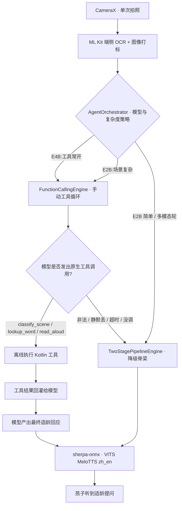
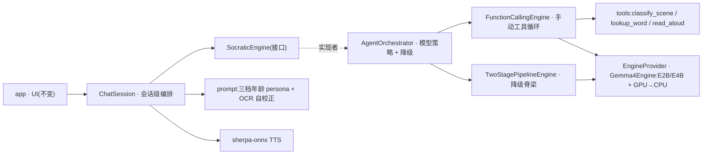

<p align="center">
  
</p>
<h1 align="center">LumiRead · 光语伴读</h1>
<p align="center"><a href="./README.md">English</a> | <b>简体中文</b></p>

> 一款完全离线、隐私优先的儿童绘本伴读 App,核心由端侧 **Gemma 4 E2B**
> 驱动。每一次拍照、每一句回答,都不离开手机。

<p align="center">
  <a href="./LICENSE"></a>
  <a href="#5-系统要求"></a>
  <a href="https://ai.google.dev/gemma"></a>
</p>

---

## 🎬 演示视频

看 LumiRead 实机演示 —— 全程离线的绘本伴读、端侧 Gemma 4 E2B、
温暖的"博学故事伙伴"对话:

**▶️ [在 Bilibili 观看演示视频](https://www.bilibili.com/video/BV17Q7D6HEay/)**

<p align="center">
  <a href="https://www.bilibili.com/video/BV17Q7D6HEay/"></a>
</p>

---

## 🚀 新手指南 · 先看这里(不懂电脑也能用)

不懂代码也没关系,这一节就是给你的。

- **只想用?** 到 [Releases](../../releases) 页面下载最新版 **APK**,装到安卓手机上即可,
  不用懂任何代码。
- **该选哪个 AI"大脑"?**(在 App 设置里)
  - **低龄孩子 →** *E2B + 独立 OCR*——更快,更有对话感。
  - **高龄孩子 →** *E4B + 独立 OCR*。
  - 一体识别的**多模态**模式仍是实验性的,**不太稳定,请谨慎选择。**
- 首次启动会一次性下载离线 AI 模型(几个 GB,建议连 Wi-Fi);之后全程无需联网。

---

## 目录

1. [项目概览](#1-项目概览)
2. [普惠初心](#2-普惠初心)
3. [功能特性](#3-功能特性)
4. [工作原理](#4-工作原理)
5. [系统要求](#5-系统要求)
6. [安装与运行(普通用户)](#6-安装与运行普通用户)
7. [自行构建(开发者)](#7-自行构建开发者)
8. [隐私](#8-隐私)
9. [开源致谢](#9-开源致谢)
10. [许可证](#10-许可证)
11. [参与贡献](#11-参与贡献)
12. [Roadmap](#12-roadmap)
13. [更新日志](#13-更新日志changelog)

---

## 1. 项目概览

LumiRead 是一款 Android 应用,把任意一本**纸质绘本**变成一位
温暖、耐心、博学的伴读伙伴 ——
**而且全程不向任何服务器发送一个字节**。

**它解决什么问题。** 市面上多数"儿童 AI 伴读"产品都建立在一条隐性的
交易上:把孩子的语音、屏幕时间、注意力上传到云端,换一个能说会道的助手。
家长为此付出的代价,往往比换来的功能贵得多。

**我们的取舍。** 纸质绘本仍然是儿童想象力最好的支点。LumiRead 不
试图取代它,而是站在它身旁:孩子把手机对准绘本的某一页,App 用
**纯端侧推理**给出一段简短、贴合年龄的"夸赞 → 详细解释 → 拓展提问"。
手机是讲故事人的助手,而不是讲故事的人本身。

**面向谁**
- 重视孩子隐私与屏幕时间的家长和祖辈。
- 中英双语家庭 —— 当前绘本可能是其中一种家长不太熟练的语言。
- 想看一个**真实跑得动**的端侧 2.5 GB 级 LLM 完整案例的边缘 AI 研究者。

**为什么有意思**
- **完全离线。** 没有埋点、没有分析、没有云端调用。飞行模式下完整可用。
- **隐私来自结构,而非承诺。** 全 App 唯一的网络访问是首次启动时的
  一次性模型下载;不想下,你可以直接 `adb push` 模型文件。
- **真正能用的端侧 AI。** 在骁龙 8 系级别的手机上,GPU 后端下首词大约
  4–6 秒可发声。
- **AI for Social Good。** 为 2026 Gemma 开发者黑客松 Edge AI 赛道而做。

---

## 2. 普惠初心

LumiRead **完全在设备本地运行**。模型一次性下载后,使用过程**无需联网、无需账号、无需服务器**——AI 伴读老师就住在手机里。

- **没有网络的地方也能用。** 在偏远山区、乡村学校,或任何信号微弱、没有移动数据的地方,LumiRead 都能离线工作。孩子的学习,不该止步于网络覆盖的边缘。
- **不产生持续费用。** 没有订阅、没有按次计费的云端 API、没有上传服务器的流量账单。装好之后,每一个故事都是免费的。
- **隐私由设计保证。** 孩子翻拍的绘本与开口的回答,全程不离开本机。

通过把一个有能力的语言模型搬到端侧,LumiRead 希望把温暖的、苏格拉底式的阅读陪伴,带给那些被云端应用落下的家庭与课堂。

---

## 3. 功能特性

v3.0.0 真实可用、已端到端跑通的功能:

- **拍页伴读。** 单张拍照、对齐取景框,App 给出一段语音化的
  "夸赞 → 详细解释 → 拓展提问",紧扣画面与文字。
- **Gemma 4 原生函数调用(带优雅降级)。** 拍到新画面时,模型可以**原生调用一个端侧工具**
  判断"绘本页 vs 眼前物品"并据此调整回应——经 LiteRT-LM 工具 API 执行真实的本地 Kotlin,
  不是字符串解析。工具调用不可用或失败时**自动回退到两阶段文本管线**,App 绝不崩。
  端侧可靠性与延迟的诚实说明见 §4。
- **v3.0.0「纸页暖色」重设计(儿童 / 家长)。** 基于设计 token 的整套 UI:
  **儿童模式**是现代绘本质感——奶油纸页底、深墨蓝+暖金色板、「魔法书框」主视觉、
  柔和星屑光点装饰、适合儿童触控的大控件;**家长模式**冷静克制,覆盖统计、设置、
  模型管理与隐私。**全 App 无任何吉祥物 / 角色头像 / 动物形象 / 拟人助手。**
- **Tier 年龄段贯穿全局(三档)。** *幼儿 · 学龄前 · 学龄* 通过单一 `Tier` 系统统一控制
  字号、按钮高度、圆角、装饰密度、动效幅度、chips 数量与回答长度——切换即时生效
  (不重启 Activity)且持久化。
- **完整拍读链路。** home → camera → crop → celebrate → thinking → dialog;v3 **相机取景器**
  (金色四角取景框 + 大金快门)与升级的 **裁切屏**(金色把手 + 九宫格 + 全选 + 实时像素尺寸),
  裁切映射回原图坐标系,喂给既有 OCR / 多模态管线,逻辑不变。
- **故事模式(没有绘本也能玩)。** 三入口:拍一样东西、选一个**由本地模型端侧生成**的开头
  (loading / ready / fallback 三态、可"换一组")、或自己输入——都走真实模型链路。
- **阅读对话支持自由输入 + 语音。** 自由追问进入同一会话;麦克风按钮走系统语音识别
  (不可用时友好回退);TTS 失败时退化为内联提示,而非恐吓式错误页。
- **内建可访问性。** sp 字号(1.5× 缩放不破版)、≥ 44 / 56 / 72–96 dp 触控目标、内容描述
  (家长门禁朗读数字)、reduced-motion 退化,以及**飞行模式下绝无红色"无网络"恐吓 banner**——
  一切本地运行。
- 一道**轻量家长门**(从两个数中点中较大的——完全离线、不存密码)仍守在儿童 → 家长方向,
  防止孩子误退出儿童壳。
- **中英文双语输出。** 输出语言是 App 内的设置,**与系统语言解耦**:
  中文系统的手机可以朗读英文页面,反之亦然。
- **双语成对输出模式。** 可选"同一句先中文后英文、逐行配对"渲染,
  方便希望两种语言同屏出现的家庭与课堂。
- **App 界面语言独立切换。** 通过 `LocaleManagerCompat` 桥接的
  per-app locale(跟随系统 / 中文 / English),无需改系统设置即可
  翻转界面语言。
- **三档年龄段。** *Toddler(幼儿)* / *Preschool(学龄前)* /
  *Preadolescent(学龄)*,每档都会改变词汇、句长、TTS 语速,
  以及儿童模式下的触控目标尺寸与回弹幅度。
- **多轮对话。** 同一页可以反复聊;也可以换一本继续 —— 模型携带
  一段滚动历史。
- **无书直聊。** 没书在手时,伴读伙伴可以编一个温暖、积极的故事开头,
  邀请孩子接龙。
- **自动 / 手动朗读切换。** 自动朗读会逐句流式播报;关闭后每条回复
  附"▶ 播放"按钮,由孩子自主决定何时听。
- **"我的学习"页面。** 本地完整记录学习时长、累计次数、使用的语言、
  近期会话条目。**不上传任何数据。**
- **OCR 模式设置。** 默认走两阶段管线(ML Kit 端侧 OCR + 图像打标 +
  纯文本 Gemma 4),为最低首词延迟优化;此外提供基于 Gemma 4 E4B
  的*原生多模态* 实验入口,在设置里有明确的延迟提示。

---

## 4. 工作原理

从 **v2.0.0** 起,LumiRead 是 *agentic* 的:不再总是手工拼好一段文本提示,而是让
Gemma 4 **原生调用端侧小工具**、再根据工具结果作答。早先"OCR → 拼接文本 → 文本模型"
的流程**不再是主线**——它作为**降级脊梁**保留,在函数调用不可用或没走通时兜底体验。

**运行时流程。**



**这是真·原生函数调用**,不是字符串解析:走 LiteRT-LM 的工具 API(**手动模式**),由
Gemma 4 的**原生工具 token** 触发、执行真实的本地 Kotlin、再用 `ToolResponse` 把结果
回灌给模型续写答案。

**三个端侧工具**(完全离线,每个 ≤2 参数——工具越多端侧可靠性实测越差,故锁定 3 个)。
按它们**在本版的真实行为**如实描述:

- **`classify_scene(image_labels, ocr_text)`** —— *完整可用。* 判断拍到的是绘本页还是
  眼前物品,据此走伴读或讲解物品。
- **`lookup_word(term)`** —— 已注册、可被调用,但**本版未随包任何离线词典**,目前返回的是
  一句适龄的"我们一起看看"兜底,而非词库释义。(没有打包任何词库——见下方诚实说明。)
- **`read_aloud(text)`** —— 已注册、可被调用,但回复本就由常开的 TTS 朗读,故该工具在本版
  的实际作用刻意保持最小。

**模块架构。**



**分层架构。** Android 壳 `:app` 持有 CameraX、ML Kit、LiteRT-LM、sherpa-onnx 等平台
相关代码。推理管线 `:core` 是纯 Kotlin/JVM 模块,通过若干小接口(`SocraticEngine` /
`LlmEngine` / `TtsEngine` / `OcrService` / `ImageLabelService`)解耦,每个都有 `Fake`
实现,可在没有任何重型库就绪时通过 JVM 单测跑通整条流程。`ChatSession` 负责会话级编排
(OCR、滚动历史、TTS、事件);`AgentOrchestrator` 选引擎(**E4B 工具常开 / E2B 仅在场景
复杂时启用**;多模态轮直接走两阶段)并做**缓冲式降级**;`FunctionCallingEngine` 跑手动
agent 循环(轮次上限、参数校验、静默丢调用检测、超时看门狗)。

**为什么两阶段还在(作为降级)。** 目前端侧多模态首字延迟动辄 10 秒以上,会直接杀死
小孩子的"对话感"。两阶段路径先用端侧 OCR + 图像打标(几百毫秒)抽信号,再以**纯文本**
喂 Gemma 4。原生多模态(Gemma 4 E4B)仍在设置里作为可选实验项,并有明确延迟提示。

**降级是脊梁,不是补丁(诚实)。** 端侧函数调用目前**并不完全可靠**:结构化评测显示
Gemma 4 E2B 工具调用通过率约 **71%**,参数越多越差。因此**任何**失败(非法 / 静默丢 /
超时 / 校验不过 / 模型干脆没调)都会**自动回退到两阶段纯文本管线**,App 绝不崩。函数调用
是亮点;**可靠的基线由降级保证**。

**性能说明(诚实)。** 函数调用的可用延迟依赖 GPU 后端(官方 ~52 tok/s)。我们的测试机
(一台骁龙手机)上 GPU 后端**对两个模型都没起来、回退了 CPU**,因此较慢:实测整段回答
约 **16 秒**(E2B)/ **46 秒**(E4B)(手动工具模式整段返回,非逐字流式)。GPU 正常的设备
会快得多。**演示建议用 *E2B + 独立 OCR*,或一台 GPU 后端可用的设备。**

---

## 5. 系统要求

| 项目 | 最低 | 推荐 |
|---|---|---|
| Android 版本 | Android 8.0 (API 26) | Android 12+ (API 31+) |
| 运行内存 | 6 GB | 8 GB |
| SoC | 骁龙 7 Gen / Tensor G2 级 | 骁龙 8 Gen 2 / 3 / Tensor G3+ |
| GPU 后端 | 支持 OpenCL 的 Adreno / Mali / Xclipse | 同上 |
| 可用存储 | 安装后**额外 ≥ 4 GB** | 5 GB 以上更舒服 |
| 网络 | 仅首次启动下载模型需要 Wi-Fi | 同上 |

> CPU 后端仅作为开发兜底(约 4–5 tok/s),在真实伴读体验下不可用。

---

## 6. 安装与运行(普通用户)

### 6.1 安装 APK

1. 从 [GitHub Releases](https://github.com/LagrangeNSS/LumiRead/releases)
   下载 `app-release.apk`。
2. 对照 Release 说明中的 SHA-256 校验文件。
3. 在手机上安装(可能需要在"设置 → 安装未知应用"里给一次权限)。
   APK **约 290 MB**,体积主要来自打包的 LiteRT-LM、sherpa-onnx、
   ML Kit、ONNX-Runtime **原生库**,且为四种 ABI(`armeabi-v7a`、
   `arm64-v8a`、`x86`、`x86_64`)都各带一份。**不包含** Gemma 4 模型
   权重,也不包含 MeloTTS 声学模型。

### 6.2 首次启动 —— 下载模型

首次启动时,App 会引导你下载:

- **Gemma 4 E2B 权重**(`gemma-4-E2B-it.litertlm`),**约 2.59 GB**,
  建议 Wi-Fi。这是一次性下载,文件存放在 App 的外部文件目录下,
  全程不会上传到任何地方。
- **MeloTTS 声学模型**(`vits-melo-tts-zh_en`),**约 189 MB**。
- 之后即可在飞行模式下使用,App 不再有任何网络调用。

### 6.3 评测者 / 慢网兜底 —— `adb push` 直接侧载

不想在 App 内下载,可以用 `adb`:

```bash
# 把源路径换成你下载到本地的实际位置
adb push gemma-4-E2B-it.litertlm \
    /sdcard/Android/data/com.lumiread/files/
adb push vits-melo-tts-zh_en \
    /sdcard/Android/data/com.lumiread/files/
```

App 启动时会自动检测到文件并跳过下载步骤。

---

## 7. 自行构建(开发者)

### 7.1 工具链

| 工具 | 版本 |
|---|---|
| JDK | 17(`JAVA_HOME` 需指向一个 JDK 17 安装) |
| Android Gradle Plugin | 9.2.1(声明在 `gradle/libs.versions.toml`) |
| Kotlin | 2.3.21 |
| Android SDK | platform 36 / build-tools 36.x |
| Gradle | 走 wrapper(`./gradlew`) |

### 7.2 克隆与配置

```bash
git clone https://github.com/LagrangeNSS/LumiRead.git
cd LumiRead

# 告诉 Gradle 你的 Android SDK 在哪 —— 此文件已被 .gitignore 排除
echo "sdk.dir=$ANDROID_HOME" > local.properties
```

### 7.3 获取 sherpa-onnx AAR

`sherpa-onnx` 不在 Maven Central,工程通过本地 `libs/` 目录引入:

1. 打开 https://github.com/k2-fsa/sherpa-onnx/releases。
2. 下载 `sherpa-onnx-1.13.2.aar`。
3. 放到仓库根目录下的 `libs/sherpa-onnx-1.13.2.aar`(`libs/` 不存在则
   自行创建)。

### 7.4 获取模型

模型文件**不进**本仓库,也**不打入** Release APK,完整留给最终用户
在自己设备上获取。

- **Gemma 4 E2B(LiteRT-LM 版)。** Hugging Face 仓库
  [`litert-community/gemma-4-E2B-it-litert-lm`](https://huggingface.co/litert-community/gemma-4-E2B-it-litert-lm)。
  首次下载需在模型页面接受 Gemma 条款与 Apache-2.0 模型许可证。

  ```bash
  pip install -U "huggingface_hub[cli]"
  huggingface-cli download litert-community/gemma-4-E2B-it-litert-lm \
      gemma-4-E2B-it.litertlm --local-dir ./models/
  ```

- **MeloTTS 中英双语模型(`vits-melo-tts-zh_en`)。** 来自 sherpa-onnx
  的预训练模型索引:
  https://github.com/k2-fsa/sherpa-onnx/releases
  (找 `vits-melo-tts-zh_en` 那个压缩包),解压到 `./models/`。

如需在真机上直接跳过 App 内下载,用 §6.3 的 `adb push` 命令侧载到
`/sdcard/Android/data/com.lumiread/files/`。

### 7.5 构建与运行

```bash
# Debug 包安装到已连接设备:
./gradlew :app:installDebug

# Release APK(默认未签名,如需发布请自带 keystore):
./gradlew :app:assembleRelease

# 纯 JVM 单测,跑推理管线的 Fake 路径(无需 Android / 模型):
./gradlew :core:test

# 真机集成冒烟测试(需要一台已侧载好模型的真机):
./gradlew :app:connectedDebugAndroidTest
```

---

## 8. 隐私

- **运行时无网络请求。** 除首次启动**可选**下载模型外,App 不发起任何
  网络调用。模型就绪后可以一直离线使用。
- **无埋点、无分析、无崩溃上报后端。** 没有 Firebase、没有 Crashlytics、
  没有任何会回家的第三方 SDK。
- **无账号、无登录。**
- **相机数据不离设备。** App 内拍摄的照片写到 App 私有缓存目录,
  会话结束后由 App 主动清理。
- **不录音。** LumiRead 通过屏幕听你,而不是通过麦克风 —— 它只说,
  从不记录孩子的声音。
- **学习记录纯本地。** "我的学习"页面读的是设备本地 Room 数据库,
  App 不会上传它。

所有 ML Kit 模型(OCR 与图像打标)走 `bundled` 版本,**纯端侧推理**,
也不需要联网拉模型。

---

## 9. 开源致谢

没有下面这些项目,就没有 LumiRead。完整清单(含许可证与来源链接)
见 [THIRD_PARTY_NOTICES.md](./THIRD_PARTY_NOTICES.md)。

**开源模型**
- [Gemma 4 E2B](https://ai.google.dev/gemma)(Google)—— Apache-2.0。
  指令微调的 `.litertlm` 版托管在
  [`litert-community/gemma-4-E2B-it-litert-lm`](https://huggingface.co/litert-community/gemma-4-E2B-it-litert-lm)。
- [MeloTTS](https://github.com/myshell-ai/MeloTTS)(MyShell.ai)—— MIT。
  本项目运行时用到的 `vits-melo-tts-zh_en` 衍生自这里。

**开源框架**
- [LiteRT-LM](https://github.com/google-ai-edge/LiteRT-LM)(Google)
  —— Apache-2.0。端侧 LLM 运行时。
- [sherpa-onnx](https://github.com/k2-fsa/sherpa-onnx)(小米 / k2-fsa)
  —— Apache-2.0。端侧 TTS 运行时。
- [AndroidX / Jetpack Compose / CameraX / AppCompat](https://developer.android.com/jetpack)
  —— Apache-2.0。UI、相机、per-app locale 与持久化。
- [Kotlin](https://kotlinlang.org/) 与
  [kotlinx.coroutines](https://github.com/Kotlin/kotlinx.coroutines)
  (JetBrains)—— Apache-2.0。

**开源字体**
- [站酷快乐体 / ZCOOL KuaiLe](https://github.com/google/fonts/tree/main/ofl/zcoolkuaile)
  (站酷)—— SIL Open Font License 1.1。儿童模式中通篇使用的圆润、
  孩子友好的显示字体(单字体即覆盖拉丁 + 简体中文)。

**构建中用到的闭源 SDK(诚实声明)**
- [Google ML Kit](https://developers.google.com/ml-kit) —— Google 闭源
  SDK,用于端侧 OCR(拉丁 + 中文)、语种判定、图像打标。**不是开源
  软件**,在此单列,坦白告知用户 APK 内有这部分。

特别感谢 Google 用真正的开源协议释放 Gemma 4,也感谢 LiteRT-LM 团队
让它在本届黑客松的半个月窗口里**真的能在消费手机上跑起来**。

---

## 10. 许可证

本仓库中的 LumiRead 源代码采用 **Apache License 2.0** —— 详见
[LICENSE](./LICENSE) 与 [NOTICE](./NOTICE)。

运行时所用的模型、框架与 SDK 各自有**独立的许可证条款**,见
[THIRD_PARTY_NOTICES.md](./THIRD_PARTY_NOTICES.md) 与上文 §9。

> **关于 APK 的诚实声明。** Release 中的 `app-release.apk`
> **不包含** Gemma 4 模型权重;最终用户在首次启动时,直接从模型上游
> 按其 Apache-2.0 条款下载模型。

---

## 11. 参与贡献

这是一个早期黑客松版本,欢迎 Issue 与 PR。

提交前请:
- 本地至少跑过 `./gradlew :core:test` 和 `./gradlew :app:assembleDebug`。
- 保持 `:core` 模块**不依赖任何 Android UI / framework** —— 这一约束
  是为了推理管线能在 JVM 单测里独立运行,也为将来移植到其他平台留
  余地。

---

## 12. Roadmap

下面是想做、但**尚未做**的事情。v2.0.0 里都没有。

- **分年龄段研究。** 针对不同年龄段儿童展开针对性研究与调查,了解各年龄段最能接受的输出
  方式与 UI 设计,并据此在后续版本中优化。
- **为 `lookup_word` 接入离线词典**(如 WordNet / CC-CEDICT),让它返回真实释义而非兜底。
  *(计划中——本版未做。)*
- **Windows 端 UWP 移植**,与 `:core` 推理管线共用。*(计划中。)*
- **逐页书签 / 历史回溯**,孩子可以回顾自己读过的内容。
- **家长端周报**,完全本地生成、可导出 PDF。
- **自定义童声**,基于家长一段短录音的本地训练(研究方向,不承诺)。
- **平板优化布局**,书 + 对话左右分栏。

---

## 13. 更新日志(Changelog)

### v3.0.0 —— 「纸页暖色」UI/UX 重设计

- **重设计**整套 UI,基于 v3 设计 token:新 `LumiPalette`(奶油 / 深墨 / 暖金)+ `Tier` 系统
  (幼儿 / 学龄前 / 学龄)统一驱动字号、尺寸、圆角、装饰密度与动效幅度;主题 mode 跟随导航
  (儿童区 vs 家长区)。
- **重建**每一屏:儿童首页、v3 相机取景器、升级裁切屏(金色把手 + 九宫格 + 全选 + 实时尺寸)、
  celebrate / thinking 过渡屏、阅读对话(自由输入 + 麦克风 + TTS)、故事模式(三入口,开头由
  **本地模型端侧生成**)、家长区(数字门禁、学习统计、设置、隐私)。
- **移除**吉祥物——全 App 无任何角色 / 头像 / 动物 / 拟人助手。
- **新增** ~150 条本地化文案(中 / 英);儿童模式无技术词。可访问性:1.5× 字号不破版、大触控目标、
  内容描述、reduced-motion 退化、无恐吓式离线 banner。
- **未改动**:`:core` 推理管线、LiteRT-LM / Gemma 4 / ML Kit / sherpa-onnx 集成、DataStore/Room
  存储——未触碰任何 core API 签名。故事开头生成复用 `LlmEngine.generate` 并带优雅回退。
- **修复**:切换界面语言不再跳回首页(跨语言 recreate 保留当前屏)。

### v2.0.0 —— 原生函数调用重构(仅后端,UI 零改动)

- **新增** 深度利用 Gemma 4 原生函数调用的 agentic 路径(LiteRT-LM 手动工具模式):
  `classify_scene` / `lookup_word` / `read_aloud` 三个离线工具,由模型**原生工具 token**
  触发、执行真实本地代码、结果回灌后产出最终回答(非字符串解析)。
- **新增** 模块化 `:core` agent 分层:`SocraticEngine` 接口 + `TwoStagePipelineEngine`(降级脊梁)
  + `FunctionCallingEngine`(手动循环 + 校验 + 超时看门狗)+ `AgentOrchestrator`(模型策略 + 缓冲式降级)。
- **新增** 模型策略:**E4B 工具常开 / E2B 复杂度门控**;多模态轮自动走两阶段。
- **新增** 引擎加载后**隐藏 warm-up 生成**,缓解 GPU 首调毛刺。
- **新增** 每轮 served-by / 延迟可观测指标(演示 agentic 闭环)。
- **保留** v1.x 全部功能(双模式 UI、三类语言设置、双语、TTS、语音输入、"我的学习")且 **UI 零改动**。
- **诚实声明**:端侧函数调用尚不完全可靠,体验由**降级脊梁**保证;GPU 不可用的设备上延迟较高(见 §4)。

> 早期版本(v1.0–v1.2)的功能见上文 §3 功能特性。

---

<sub>为 2026 Gemma 开发者黑客松 · Edge AI 方向而做。
献给纸质绘本,以及爱它们的小小读者。</sub>
